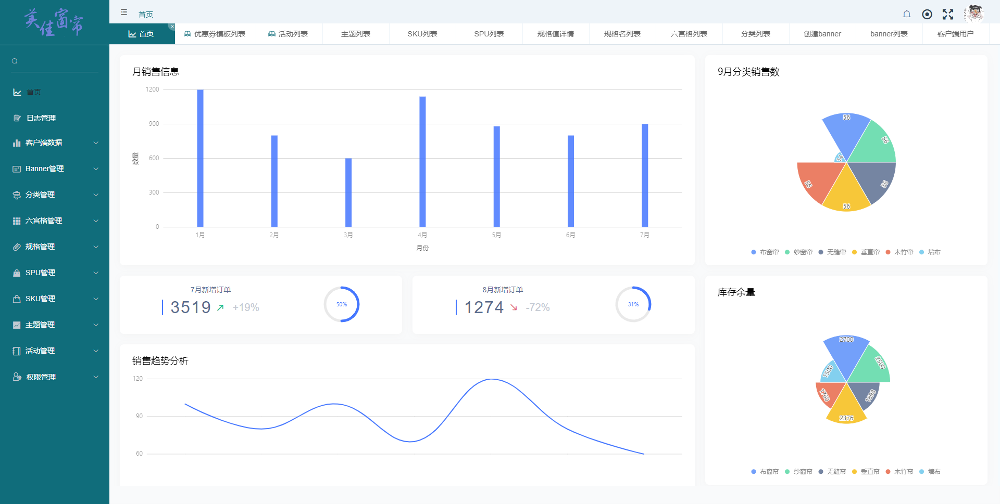

# coisini-curtain

#### 介绍

美佳布艺 - 窗帘电商小程序

项目架构：Java API + CMS + 小程序

#### 项目地址
CMS：[美佳窗帘布艺 - https://www.meijia.pub](https://www.meijia.pub)
 
小程序：美佳布艺（微信搜一搜）

#### 软件架构

SpringBoot + Mysql + RocketMQ + Vue + 小程序

#### 目录结构

├── curtain-manage   CMS Java API
 
├── curtain-element   CMS Vue 前端
 
├── curtain-server      小程序 Java API
 
├── curtain-store        小程序-窗帘商城
 
├── data          数据

#### 安装教程

1.  小程序 -  cms-store/README.md

#### 使用说明

1.  cms-pictures请使用tomcat/nginx加载，地址与数据库相对应
2.  小程序需安装linui，参照cms-store/README.md 
3.  cms： root/P@ssw0rd           guest/P@ssw0rd 

## 使用截图

### 感谢

[Maggieq8324](https://github.com/Maggieq8324/coisini-curtain)

###### 项目完成时间：2021年10月
